# IMC Prosperity 4 - Stochastic Bulls

> **IMC Prosperity 4** is IMC Trading's annual global algorithmic and manual trading competition for STEM students, running from April 14 to April 30, 2026. Teams of up to five compete across five rounds, each consisting of one algorithmic challenge and one manual challenge, maximising profit in the competition's virtual currency, **XIRECs**.

---

## The Team

| [](https://www.linkedin.com/in/marcobattiston/) | [](https://www.linkedin.com/in/michele-beltrame-625066292/) | [](https://www.linkedin.com/in/claudia-rocas-corrons-370a1a364/) | [](https://www.linkedin.com/in/davide-tonini/) | [](https://www.linkedin.com/in/leonardo-zamprotta/) |
|:---:|:---:|:---:|:---:|:---:|
| [Marco Battiston](https://www.linkedin.com/in/marcobattiston/) | [Michele Beltrame](https://www.linkedin.com/in/michele-beltrame-625066292/) | [Claudia Rocas Corrons](https://www.linkedin.com/in/claudia-rocas-corrons-370a1a364/) | [Davide Tonini](https://www.linkedin.com/in/davide-tonini/) | [Leonardo Zamprotta](https://www.linkedin.com/in/leonardo-zamprotta/) |

## Results

The 2026 edition saw:
- Number of competing players: 30,703
- Number of competing teams: 18,803
- Number of universities represented: 1,549 universities
- Number of countries represented: 117 countries

Our placement among all teams: 

| Phase | Round | Algorithmic | Manual | XIRECs | Global rank |
|-------|-------|-------------|--------|--------|-------------|
| Phase 1 | Round 1 | 98,319 (921st) | 87,995 (1st) | 186,314 | **703 (top 3.5%)** |
| Phase 1 | Round 2 | 99,931 (186th) | 183,999 (139th) | 470,244 | **569 (top 3.0%)** |
| Phase 2 | Round 3 | 29,929 (1019th) | 68,640 (510th) | 98,569 | **1102 (top 6.0%)** |
| Phase 2 | Round 4 |  103,735  (460th) | 3,223 (885th) | 205,527 | **715 (top 4.0%)** | 
| Phase 2 | Round 5 |  33,091 (542nd) | -32,909 (1936th) | 205,709 | **1077 (top 6.0%)** |

Phase 1 (Round 1 & 2):
- (Globally) Ranked **569th** overall.
- Gained access to phase 2 by accumulating more than 200,000 XIRECs in the first two rounds.

Phase 2  (Round 3, 4 & 5):
- (Globally) Ranked **494th** for Algorithmic trading, **2496th** for Manual trading and **1077th** overall.

## Our Journey & Spirit
As first-year Computational Finance students at the University of Padua, we approached IMC Prosperity 4 primarily as a learning opportunity.
Being at the beginning of our academic path, many of the tools and methodologies required by the challenge were new to us; we chose to dive in anyway to test our skills and bridge the gap between theory and practice.

The second half of the competition coincided with a demanding period of university exams and projects. While this required us to prioritize our academic commitments during Phase 2, we remained dedicated to completing the challenges, valuing the hands-on experience and the steep learning curve over our final global ranking.

---

## Table of Contents

- [Competition structure](#competition-structure)
- [Repository structure](#repository-structure)
- [Code Architecture](#code-architecture)
- [Algorithmic Trading](#algorithmic-trading)
  - [Round Tutorial: Market-Making Fundamentals](#algo-round-tutorial)
  - [Round 1: Stationary MM + Trend Following](#algo-round-1)
  - [Round 2: Stationary MM + Trend Following (Additional Volume)](#algo-round-2)
  - [Round 3: Options Pricing](#algo-round-3)
  - [Round 4: Informed Traders](#algo-round-4)
  - [Round 5: Pairs Trading, Zero-Sum Baskets, Correlations](#algo-round-5)
- [Manual Challenges](#manual-challenges)
  - [Round 1: Exchange Auction](#manual-round-1)
  - [Round 2: Capital Allocation](#manual-round-2)
  - [Round 3: Invest & Expand](#manual-round-3)
  - [Round 4: Exotic Derivatives](#manual-round-4)
  - [Round 5: News-Based Trading](#manual-round-5)
- [Reproducibility](#reproducibility)

---

## <a id="competition-structure"></a>[Competition structure](#competition-structure)

Five rounds of ~2 days each. Every round introduces new tradeable products and increases market complexity. 

Algorithmic challenges:

| Round | Products | Core theme |
|-------|----------|------------|
| Tutorial | `EMERALDS`, `TOMATOES` | MM fundamentals |
| Round 1 | `ASH_COATED_OSMIUM`, `INTARIAN_PEPPER_ROOT` | Stationary MM + Trend Following |
| Round 2 | `ASH_COATED_OSMIUM`, `INTARIAN_PEPPER_ROOT` | Stationary MM + Trend Following (Additional Volume) |
| Round 3 | `VELVETFRUIT_EXTRACT`, `HYDROGEL_PACK` | Options Pricing |
| Round 4 | `VELVETFRUIT_EXTRACT`, `HYDROGEL_PACK` | Informed Traders |
| Round 5 | `50` assets divided in `10` categories | Pairs Trading, Zero-Sum Baskets, Correlations |

Manual challenges:

| Round | Products | Core theme |
|-------|----------|------------|
| Round 1 | `DRYLAND FLAX`, `EMBER MUSHROOM` | Auction |
| Round 2 | `SCALE`, `RESEARCH` & `SPEED` | Investment, Optimization, Game Theory |
| Round 3 | `ORNAMENTAL BIO-POD` | Auction, Game Theory |
| Round 4 | 12 `AETHER CRYSTAL` Options | Exotic Options, Optimization & Delta Hedging |
| Round 5 | 9 Tradable Goods on `IGNITH MARKET` | News Trading |


---

## <a id="repository-structure"></a>[Repository structure](#repository-structure)

```
imc-prosperity-4/
│
├── prosperity4/
│   ├── round_/
│   │   ├── data/               # contains challenge data
│   │   ├── manual/             # contains manual trading analysis (notebooks)
│   │   ├── notebooks/          # contains algo trading analysis (notebooks)
│   │   └── Trader.py           # contains algorithmic trading strategies
├── .gitignore
├── .python-version
├── uv.lock
├── pyproject.toml
└── README.md
```

---

## <a id="code-architecture"></a>[Code Architecture](#code-architecture)

The codebase follows a three-layer class hierarchy, an approach pioneered by top competitors in previous editions of the competition. You can see the original inspiration in [TimoDiehm's IMC Prosperity 3 repository](https://github.com/TimoDiehm/imc-prosperity-3/tree/main).

**`ProductTrader` (base class)**: the shared foundation every asset-specific trader inherits from. Its constructor fires on every tick and automatically extracts everything you need from the `TradingState`: the full order book parsed into `mkt_buy_orders` / `mkt_sell_orders` dictionaries, best/second-best/worst bid and ask prices, fair value estimate based on max-volume levels, spread, position limits, and current position. It also exposes two clean order-placement methods (`bid()` and `ask()`) that automatically cap quantities at whatever room remains within the position limit, so asset-specific logic never has to worry about breaching it. State persistence across ticks is handled via `last_traderData` (read) and `new_trader_data` (write), serialised as JSON through the engine's `traderData` string.

**`OsmiumTrader` / `RootTrader` (asset-specific classes)**: each inherits from `ProductTrader` and overrides only `get_orders()`, where the actual algorithmic strategy lives. They read the pre-computed market data from the base class and emit a list of `Order` objects.

**`Trader` (entry point)**: the single class the IMC engine calls each tick. Its `run()` method instantiates each asset-specific trader, collects their orders into a combined `result` dict, serialises the updated state, and returns `(result, conversions, final_trader_data)`.

---

## <a id="algorithmic-trading"></a>[Algorithmic trading](#algorithmic-trading)


### <a id="algo-round-tutorial"></a>[Round Tutorial: Market-Making Fundamentals](#algo-round-tutorial)

The tutorial served as a soft introduction to IMC Prosperity 4's custom trading engine. It required trading two basic assets: `EMERALDS` (a stationary asset with a fixed true value) and `TOMATOES` (an asset with slight price drift). Our solution implemented basic market-making: providing liquidity around the mid-price to capture the spread, while utilizing inventory management to avoid breaching the position limits.

### <a id="algo-round-1"></a>[Round 1: Stationary MM + Trend Following](#algo-round-1)

### `INTARIAN_PEPPER_ROOT`: Pure Trend Following

**Asset behaviour:** Data analysis revealed that Pepper Root follows an almost perfectly linear price trend with slope `0.001` per timestamp and R² = 0.9999.

**Strategy:** The entire position limit (`TREND_ALLOC = 80` units) is committed to a permanent long from the first tick. On the very first timestamp, the trader places a market-aggressive bid at `best_ask` for all 80 units, guaranteeing an immediate fill. The flag `root_trend_bought` is then set to `True` and persisted in `traderData` so the entry is never repeated. The position is then held for the full duration of the round, accumulating approximately 0.001 XIRECs per timestamp in price appreciation.

**What we attempted but left out:**

<u>Entry optimisation:</u> Rather than crossing the spread aggressively on a single tick, we explored splitting the 80-unit entry across multiple timestamps — buying gradually as the asset ticked up, potentially at better prices if the ask side had limited depth. The problem is that any tick spent partially filled is a tick of trend appreciation missed on the unfilled units, and on a near-perfectly linear asset the opportunity cost of a delayed entry outweighs any spread savings. The all-in approach on tick one proved simpler and more robust.

<u>Market-making leg:</u> The code contains scaffolding for a separate MM leg (`FLUCT_ALLOC`), intended to trade the spread with the remaining position capacity alongside the directional hold. In principle this was attractive: the Pepper Root spread was wide enough that quoting inside it could have generated additional income. In practice, passively quoting the ask side on a steadily rising asset is structurally difficult: fair value continuously undercuts your resting ask, making it hard to collect the spread without accumulating unwanted short exposure. We could not find a configuration that made this reliably profitable, and `FLUCT_ALLOC` is set to `0` in the final submission.

---

### `ASH_COATED_OSMIUM`: Kalman Filter + Z-Score Mean Reversion

**Asset Behavior:** Unlike Pepper Root, Osmium is noisy and mean-reverting: prices oscillate around a slowly-drifting fair value. The strategy's job is to (a) track that fair value accurately despite the noise, and (b) accumulate inventory aggressively when prices deviate significantly, anticipating reversion.

**Fair value estimation: Kalman Filter.**

Each tick, `_kalman_update()` runs a one-dimensional Kalman Filter on the observed mid-price. This is a recursive Bayesian filter that separates genuine fair-value drift (process noise `Q = 2.0`) from measurement noise in the mid-price (`R = 10.0`). The filter produces a smoothed estimate `x` of the true FV with a running variance `P`. The result is far less reactive to single-tick noise than a raw mid-price, but still adapts to genuine price movements. The state `{"x": x, "P": P}` is saved to `new_trader_data["ash_kf"]` and reloaded on the next tick.

**Z-score computation.**

The Kalman-filtered FV is fed into `_z_score()`, which maintains a rolling 100-period history of FV estimates. The Z-score is `(fv − SMA_100) / std_100`, i.e. how many standard deviations the current FV is from its recent average. This tells us whether the price is in a "stretched" state likely to revert, or in a "normal" state suitable for passive market-making.

**Order logic by regime.**

The strategy has three regimes determined by a threshold of `ZSCORE_THRESHOLD = 2.5`:

*Normal regime (`−2.5 ≤ z ≤ +2.5`).* The price is behaving normally. The trader checks whether bids or asks are "mispriced" relative to FV (within 1 tick of it), picks those off first to manage inventory, and then posts passive resting quotes 1 tick inside the current best bid/ask. If neither side is mispriced, it simply quotes `best_bid + 1` and `best_ask − 1` to collect the spread.

*Stretched high (`z > +2.5`).* The price is trading well above its recent average and is expected to revert down. The trader turns aggressive seller: it sells into any bids at or above `fv − 1` (sniping mispriced liquidity), and places a resting ask at `best_ask − 1` for the full remaining sell capacity. No buy orders are placed in this regime.

*Stretched low (`z < −2.5`).* The mirror image: the price is depressed and expected to revert up. The trader buys into any asks at or below `fv + 1` and places a resting bid at `best_bid + 1` for the full remaining buy capacity. No sell orders are placed.

**Exit.** There is no explicit exit rule. Once the Z-score normalises back inside `[−2.5, +2.5]`, the trader reverts to symmetric market-making and naturally unwinds inventory as it posts quotes on the opposite side. The position drains passively through the spread.

PnL curve:

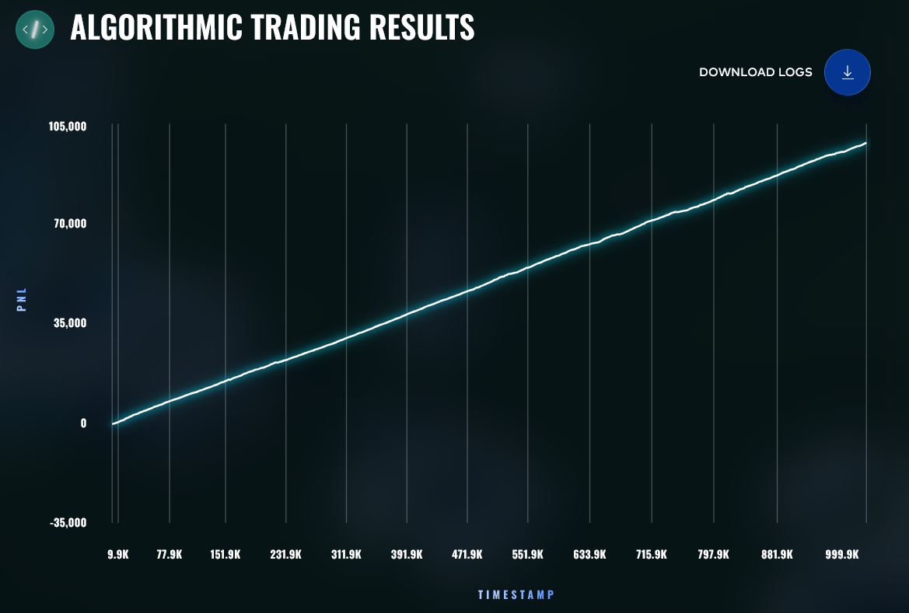

### <a id="algo-round-2"></a>[Round 2: Stationary MM + Trend Following (Additional Volume)](#algo-round-2)

Round 2 featured the exact same assets as Round 1, `ASH_COATED_OSMIUM` and `INTARIAN_PEPPER_ROOT`, with one new mechanic: a blind auction for extra market access. By bidding a Market Access Fee (MAF), participants could unlock an additional 25% of order book flow, with the fee deducted from round profits if the bid landed in the top 50%.

Bidding too low meant no extra volume, bidding too high meant paying more than the edge was worth. Without a reliable way to estimate how much additional profit the extra flow would actually generate, we chose not to meaningfully change our trading logic. The core strategies for both assets remained identical to Round 1.

On the MAF itself, we submitted a conservative bid, prioritising safety over access. Given that we were sitting roughly 10,000 XIRECs short of the 200,000 XIREC threshold required to advance to Phase 2, our primary objective was to bank a safe, predictable profit rather than chase incremental gains from extra volume that might not materialise. Taking on additional fee risk for uncertain upside did not fit that goal.

As a result, the Round 2 algorithmic submission is functionally identical to Round 1, and the PnL curve reflects this: steady and consistent.

PnL curve:

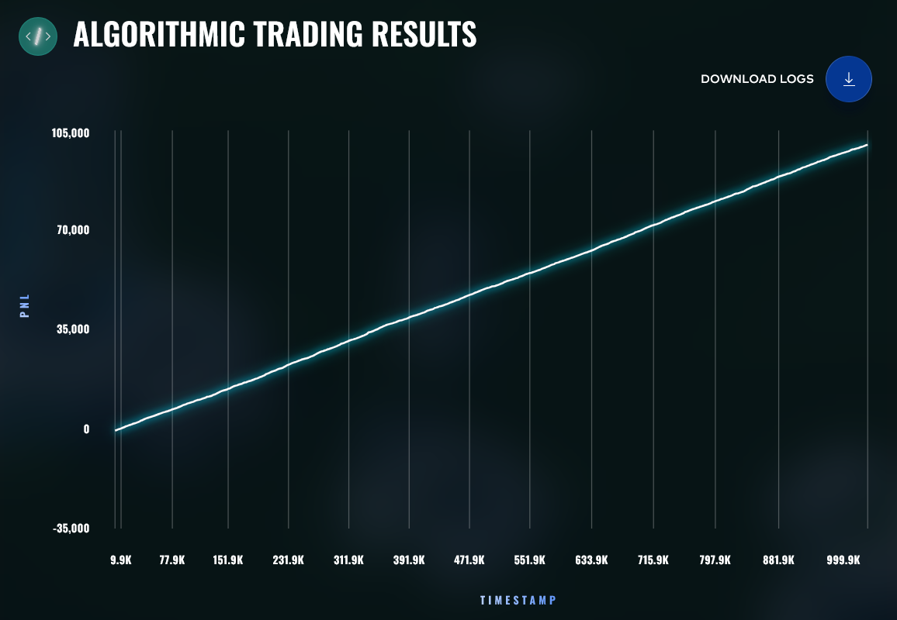

### <a id="algo-round-3"></a>[Round 3: Options Pricing](#algo-round-3)

This round introduced `HYDROGEL_PACK` and options on `VELVETFRUIT_EXTRACT` (`VEV_*`), shifting the focus to derivatives pricing and volatility modelling. The 10 vouchers, `VEV_4000` through `VEV_6500`, are European call options on VELVETFRUIT_EXTRACT with a 5-day time to expiry (TTE) at the start of Round 3. Position limits were 200 for both delta-1 products and 300 per option series.

---

#### HYDROGEL_PACK

We implemented a regime-based market maker. By tracking the Fair Value (FV) using volume imbalances, we categorized the market into five regimes: Normal, Soft Selling, Soft Buying, Aggressive Selling, and Aggressive Buying. In normal conditions we provided liquidity by quoting inside the spread; in aggressive regimes we crossed the spread to quickly accumulate or dump inventory based on hard distance-from-mean thresholds.

---

#### VELVETFRUIT_EXTRACT (Options)

The core of our Round 3 effort was building a full volatility smile and Black-Scholes pricing engine to identify mispriced options. Below is a walkthrough of the analysis and its limitations.


**Option Price Dynamics**

The following chart shows bid (green), ask (red), mid-price (black dashed), and fair value (grey, computed using the method desrcibed below) for each of the 10 strikes over time:

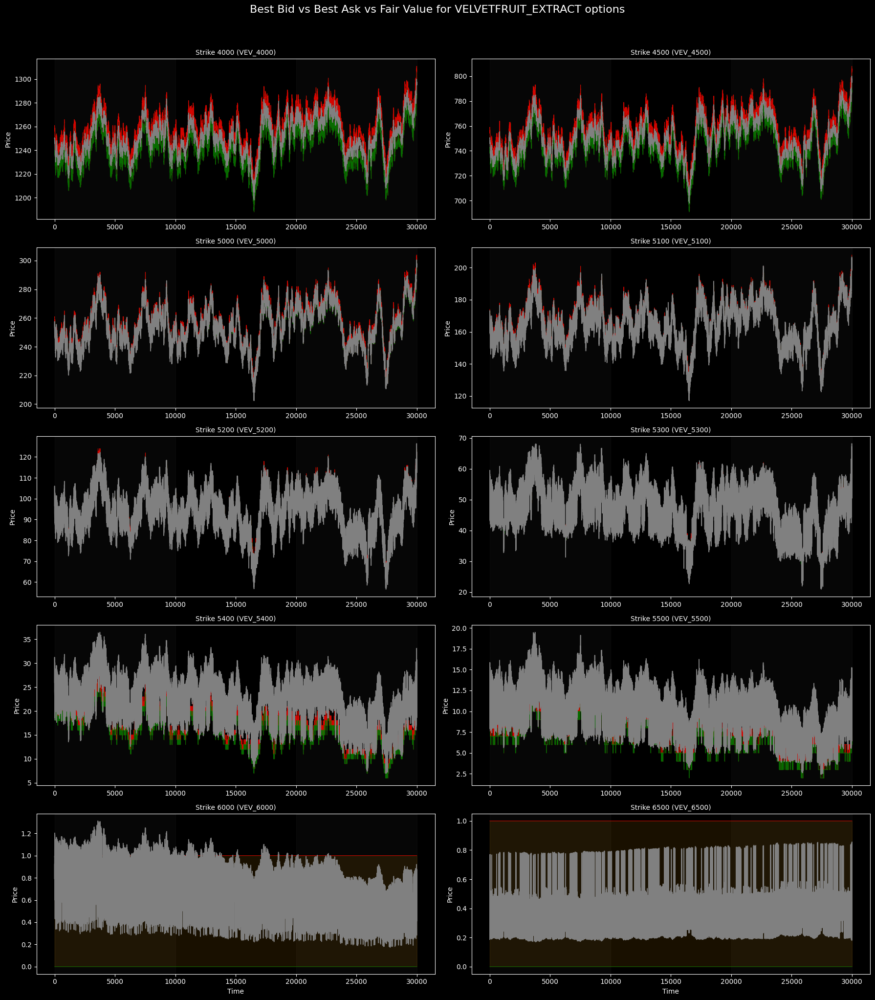

Several observations follow:

- **Deep ITM options (VEV_4000, VEV_4500):** these trade at prices of ~1200–1300 and ~700–800 respectively, very close to their intrinsic value `S - K`. Their spreads are tight and their prices track the underlying almost one-for-one. There is very little optionality premium left in these contracts.
- **Near-the-money options (VEV_5000 through VEV_5400):** these show the most interesting dynamics. Prices are in the range of ~200 down to ~15, and the bid-ask spread is wide relative to the option price, particularly for strikes 5200–5400 (even though it's not really noticable from the chart). This is where the mispricing opportunities were most likely to exist, but also where pricing errors are costliest.
- **Far OTM options (VEV_5500, VEV_6000, VEV_6500):** prices collapse toward zero and the order book becomes increasingly sparse. For VEV_6000 and VEV_6500 in particular, there are long stretches with effectively no tradeable market at all. These contracts have near-zero theoretical value and the signal-to-noise ratio in their prices is very low.


**Implied Volatility Smile**

The central piece of our analysis was backing out Implied Volatilities (IV) from market prices using a Newton-Raphson solver, then fitting a degree-2 parabola on log-moneyness to construct a smooth volatility surface.

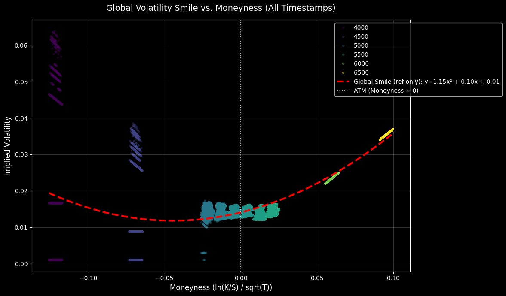

The fitted global smile is: **IV(x) = 1.15x² + 0.10x + 0.01**, where x = ln(K/S).

Key observations:

- There is a pronounced **positive skew** (upward slope to the right), meaning OTM calls are priced with higher implied volatility than ATM options. This is the opposite of typical equity skew but is consistent with a positively drifting or right-tailed underlying distribution.
- The deep ITM strikes (4000, 4500) show significant **scatter** and sit well above the fitted curve. This is a known artefact: deep ITM options have very low vega $(\nu)$, meaning a small absolute mispricing in the option price translates to a huge swing in implied volatility. The IV computed from these strikes is numerically unstable and should not be trusted for smile fitting.
- The fit was done on **IV per strike across all timestamps**, which means the smile represents a time-averaged picture. This is a meaningful limitation: the true smile shifts continuously as the underlying moves and as time to expiry decays.

**IV Deviations Over Time**

This other chart shows, for each strike, how much the market IV deviated from the fitted smile at each timestamp:

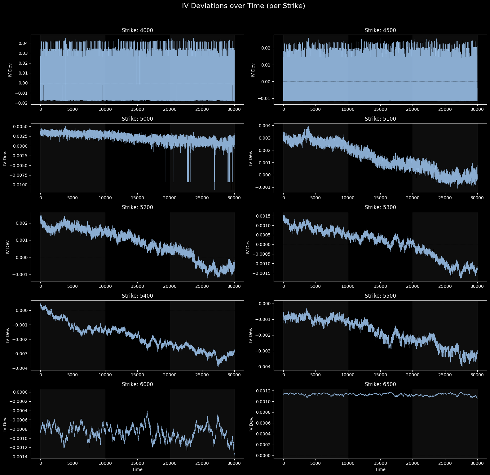

This is where the analysis reveals a structural problem with our approach:

- **VEV_4000 and VEV_4500:** IV deviations are large (±0.02–0.04) and noisy throughout the simulation. As noted above, this is driven by numerical instability in IV computation for deep ITM options with very low vega, not genuine mispricing.
- **ATM strikes (VEV_5000 through VEV_5300):** deviations are much smaller (±0.002–0.005) but show a **systematic downward drift** over time within each day. This suggests the smile was not static: as time-to-expiry decayed from 5 days toward 4 days across the simulation, the actual market IV shifted, but our fitted smile (calibrated once on historical data) did not update to reflect this.
- **Far OTM strikes (VEV_5500, VEV_6000, VEV_6500):** deviations are small in absolute terms but the contracts are illiquid, making it hard to trade these mispricings reliably.

**IV Z-Scores and Trading Logic**

With the volatility smile fitted, the trading algorithm operated by continuously comparing each option's live implied volatility against the smile's predicted IV at that strike. When the market IV deviated meaningfully from the smile's prediction, implying the option was mispriced relative to the surface, the algorithm would take the other side: buying into asks that were below theoretical fair value and selling into bids that were above it. The intuition was that short-term dislocations from the fitted smile would mean-revert, and systematically fading them would generate positive expected PnL over many timestamps.

In practice, applying this logic cleanly across all ten strikes was not feasible. The deep ITM options (VEV_4000, VEV_4500) had numerically unstable implied vols due to near-zero vega, making any smile-based signal on them unreliable. The far OTM contracts (VEV_5200 through VEV_6500) were either too illiquid to trade reliably or had bid-ask spreads too wide relative to the theoretical edge to make taking worthwhile. We therefore restricted the vol-smile market-taking logic to just **VEV_5000 and VEV_5100**, the two strikes closest to the money where the smile signal was most stable and the market was liquid enough to act on.

For the deep ITM options (VEV_4000, VEV_4500), rather than leaving them idle, we ran a separate **market-making strategy**: quoting inside the spread, lifting mispriced orders when the best bid exceeded fair value or the best ask fell below it, and posting resting quotes on both sides otherwise. These contracts were highly liquid and stable, making them well-suited to a pure spread-capture approach that did not depend on smile accuracy at all.

The remaining strikes (VEV_5200 through VEV_6500) were included in the smile calibration to improve the fit quality across a wider range of log-moneyness, but were never traded directly.

**What Went Wrong**

Our Black-Scholes / vol-smile approach was conceptually appropriate but had several flaws in its implementation:

1. **Static smile calibration.** The biggest issue: we fitted the volatility smile once on historical data and used those fixed coefficients throughout the live simulation. In reality, the smile is a dynamic surface that shifts with the underlying price, with the passage of time (theta decay), and with changes in market-wide risk sentiment. A static smile will progressively misprice options as these factors evolve, which is exactly what the IV deviation time series shows: systematic drift rather than mean-reversion noise.

2. **Deep ITM options skewing the fit.** Including VEV_4000 and VEV_4500 in the smile calibration introduced significant noise. These contracts have negligible vega, making their implied vols highly sensitive to tiny absolute pricing errors. Excluding them from the fit (or down-weighting them) would have produced a more reliable surface for the ATM and near-OTM strikes where we actually traded.

3. **TTE handling.** Our algorithm used a fixed TTE of `5/365` years. In reality, TTE decreases continuously throughout the simulation, so options were getting progressively cheaper from theta decay throughout the round. Not adjusting TTE in real time meant our theoretical prices were systematically too high by the end of each day.

4. **Sparse OTM markets.** VEV_6000 and VEV_6500 had almost no tradeable market for large stretches of the simulation. Including them in smile construction added noise without adding information.

Despite these limitations, the engine did capture some mispricing on the ATM contracts, contributing positive PnL from the options book, though less than a properly dynamic smile would have generated.

PnL curve:

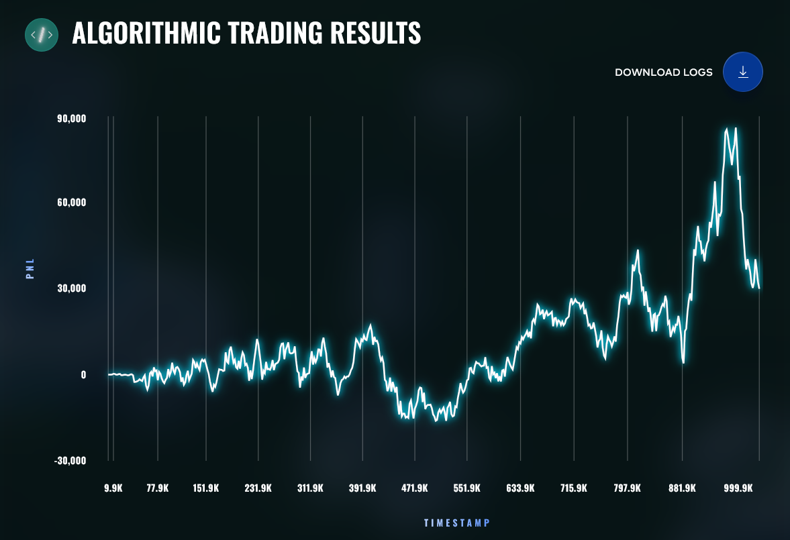

### <a id="algo-round-4"></a>[Round 4: Informed Traders](#algo-round-4)

Round 4 retained the same assets as Round 3 (`HYDROGEL_PACK`, `VELVETFRUIT_EXTRACT`, and the 10 `VEV_*` options, now with TTE = 4 days) but introduced a critical new element: **counterparty transparency**. For the first time, the `buyer` and `seller` fields in the `Trade` class were populated with real participant IDs, allowing us to study the behaviour of individual market participants and potentially exploit their information.

**The Informed Traders**

The competition disclosed six named counterparties, each with distinct trading profiles.

In each of the following pictures, we can see in the top graph the timing of the trades executed by each trader, in the middle graph their inventory, and in the bottom graph the cumulative PnL.

<table>
  <tr>
    <td>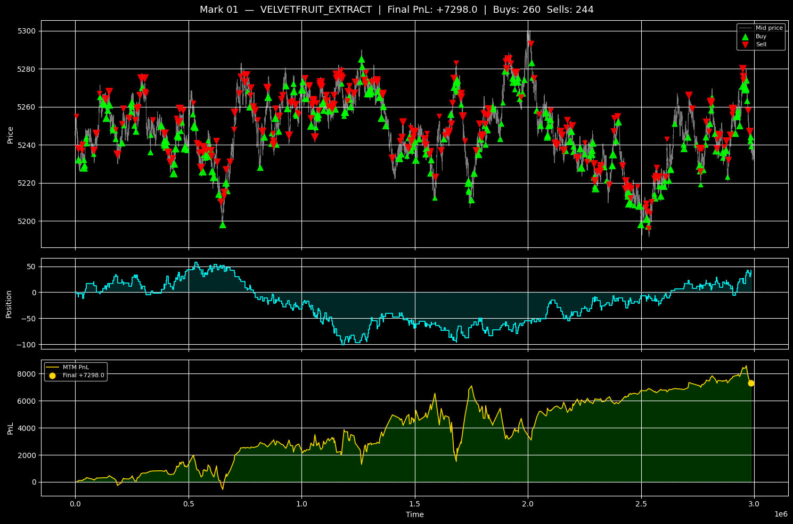<br>Mark 01</td>
    <td>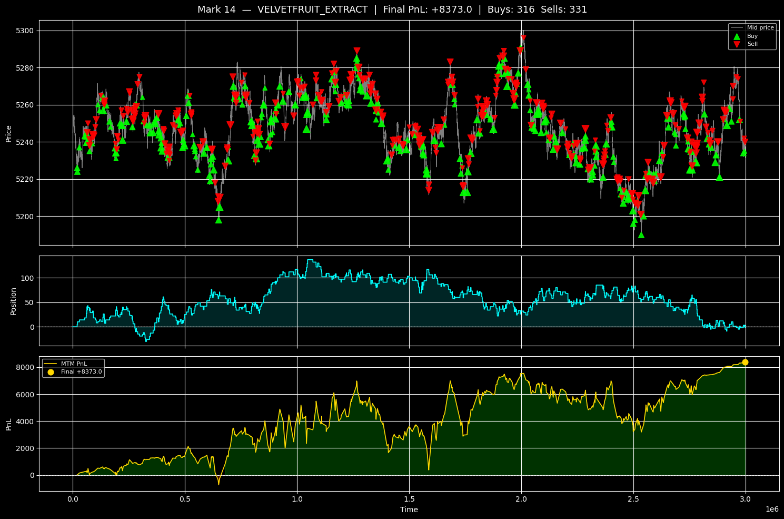<br>Mark 14</td>
  </tr>
  <tr>
    <td>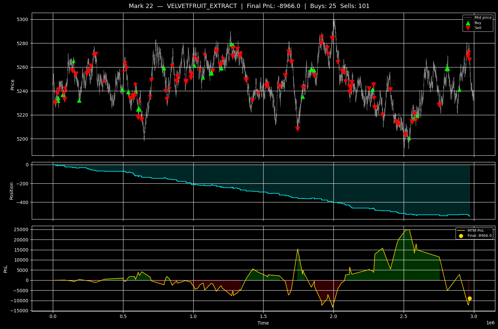<br>Mark 22</td>
    <td>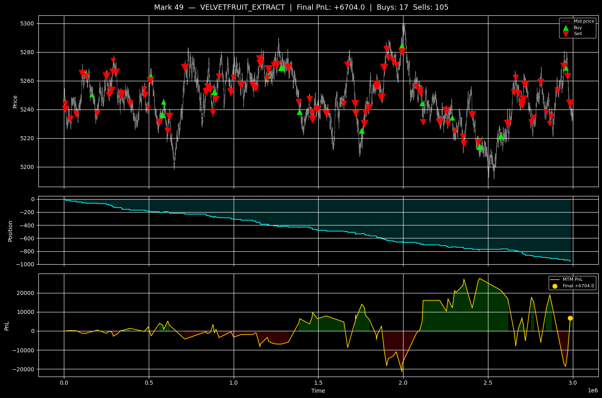<br>Mark 49</td>
  </tr>
  <tr>
    <td>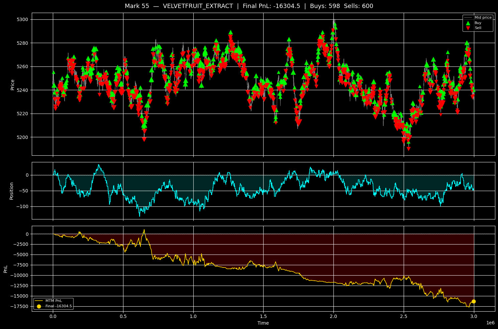<br>Mark 55</td>
    <td>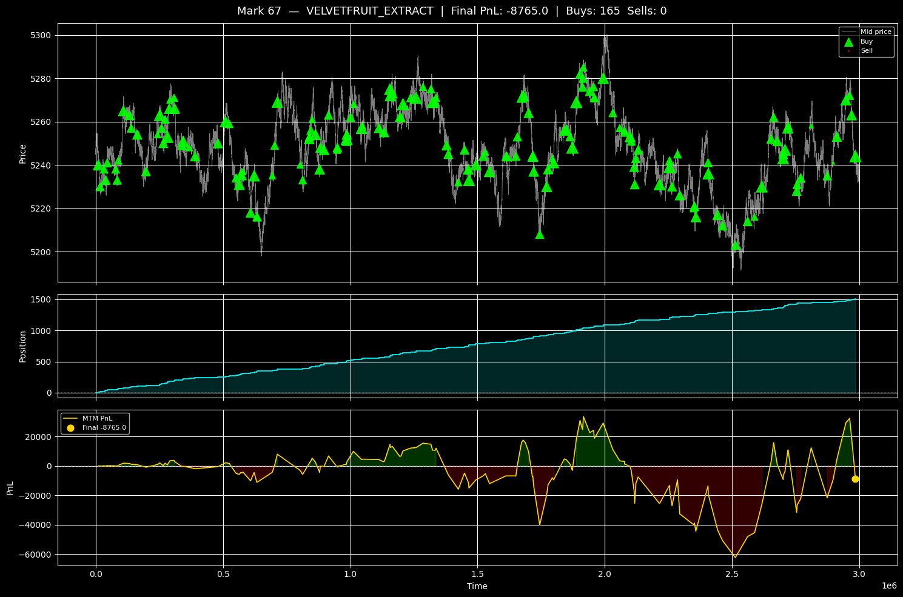<br>Mark 67</td>
  </tr>
</table>

Studying their historical statistics revealed starkly different characters:

| Trader | Trades | Final PnL | Max PnL | Min PnL | Notes |
|--------|--------|-----------|---------|---------|-------|
| Mark 01 | 504 | +7,298 | +8,600 | -559 | Consistently profitable, low drawdown |
| Mark 14 | 647 | +8,373 | +8,373 | -721 | Most profitable, monotonically increasing PnL |
| Mark 22 | 126 | -8,966 | +24,931 | -13,376 | High variance, net loser |
| Mark 49 | 122 | +6,704 | +27,546 | -21,477 | Profitable overall but extreme swings |
| Mark 55 | 1,198 | -16,305 | +1,034 | -17,774 | Most active, consistently loses |
| Mark 67 | 165 | -8,765 | +33,513 | -62,455 | Catastrophic drawdown, net loser |

**Mark 01 and Mark 14** are the smart money: they trade relatively infrequently, maintain tight drawdowns, and finish consistently profitable.
**Mark 55 and Mark 67** are noise traders or adversely selected: they trade frequently but bleed value steadily.
**Mark 22 and Mark 49** are somewhere in between: high variance players whose large Max PnL figures suggest they occasionally catch big moves, but whose overall edge is unclear.

**What We Tried**

The natural instinct was to follow the profitable traders: whenever Mark 01 or Mark 14 appeared on the buy side of a trade, buy alongside them; whenever they sold, sell. Conversely, fading Mark 55 and Mark 67 (trading against them) seemed equally appealing given their consistent losses.

In practice, neither approach worked well for several reasons:

1. **Adverse selection on entry.** By the time a trade from Mark 01 or Mark 14 appears in `market_trades`, it has already been executed at the price they chose. Any attempt to follow them by placing a new order means crossing the spread at the next available price, which is already worse than what the informed trader paid. The edge they captured was in their order; ours was diluted by the cost of following.

2. **No predictable direction.** Mark 01 and Mark 14 had a final position of +42 and -2 respectively, suggesting they were running a mean-reversion or market-making strategy themselves rather than taking a sustained directional view. Following their individual trades without understanding their inventory state meant we were just adding noise to our own book.

3. **Fading the losers was equally unreliable.** Mark 55's losses came from being consistently on the wrong side of the spread across thousands of small trades, not from taking large directional positions that we could cleanly fade. Fading a high-frequency noise trader means paying the spread on every trade we put on, the same spread they were losing, but now we're losing it too.

4. **Latency within the engine.** Counterparty data arrives in `state.market_trades`, which reflects trades from the *previous* timestamp. By the time we observe what Mark 14 did, the price has already moved. For a fast mean-reverting asset like VEV, a one-tick lag is often the difference between edge and no edge.

**What We Did Instead**

Faced with the complexity of properly exploiting counterparty data, and with the exam period beginning to compress our available time, our Round 4 submission was largely a simplification of Round 3 rather than a genuine strategic pivot. We abandoned the Black-Scholes / vol-smile engine (which had its own structural problems as documented above) and replaced it with a rolling Z-score mean reversion model across `VELVETFRUIT_EXTRACT` and the ATM options, using a 300-tick lookback and an entry threshold of ±3.0. The Hydrogel logic remained essentially identical to Round 3. The ITM options (VEV_4000, VEV_4500) were handled with a simple passive market-maker.

In practice, we did not find a reliable way to incorporate the counterparty signals into our trading logic, and the submission reflects that: the counterparty data was observed and studied in the analysis notebooks, but never meaningfully acted upon in the live algorithm.
PnL curve:

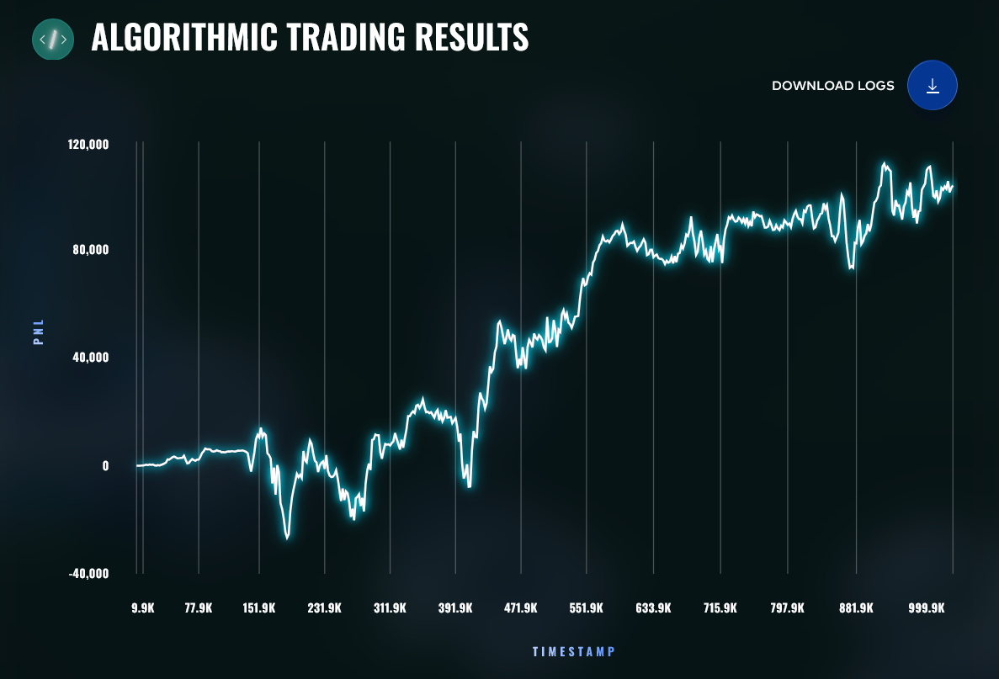

### <a id="algo-round-5"></a>[Round 5: Pairs Trading, Zero-Sum Baskets, Correlations](#algo-round-5)

The final algorithmic round was a massive scale-up: 50 brand new assets across 10 categories, all with a position limit of just 10 units each. The previous round's products were retired entirely. With the competition ending and university exams running in parallel, this was the round where the gap between what we identified and what we could actually implement was widest.

**What We Found in the Data**

Our analysis of the universe (summarised in the table below) revealed several genuinely exploitable structures that more prepared teams likely capitalised on:

| Group | Key Feature | Potential Strategy |
|-------|-------------|-------------------|
| `PEBBLES` | Sum of all 5 = constant 50,000 (zero-sum basket) | Basket arbitrage: buy the cheap subset, sell the expensive subset |
| `SNACKPACK` | 3 tight pairs with very low spread variance | Pure pairs trading on the correlated pairs |
| `MICROCHIP` | OVAL ↔ SQUARE near-perfect mirror relationship | Stat-arb on the spread |
| `ROBOT` | LAUNDRY + MOPPING sum is extremely mean-reverting (half-life ~33s) | Fast pairs trade on the sum |
| `GALAXY` / `SLEEP` / `TRANSLATOR` / `UV_VISOR` | Strong common factor (~0.35 pairwise correlation) across all 20 products | Cluster market-making with beta hedge |

**PEBBLES** was arguably the most compelling opportunity. The five sizes (XS through XL) span a wide price range (7,300–13,300) but their sum is always exactly 50,000: a hard constraint that creates a mechanical arbitrage whenever any individual pebble deviates from its fair share of 50,000. This is a clean, model-free signal that requires no estimation: if `XL + L + M + S + XS ≠ 50,000`, buy the cheap ones and sell the expensive ones until the basket closes.

**SNACKPACK** was the other high-conviction opportunity: three tight pairs with return standard deviations of just 1.5–3, meaning the spread between paired products is very stable and any deviation is quickly corrected.

**ROBOT LAUNDRY + MOPPING** had the fastest mean reversion in the universe (a half-life of roughly 33 ticks), making it suitable for high-frequency pairs trading even with a position limit of only 10 units per side.

The **GALAXY / SLEEP / TRANSLATOR / UV_VISOR cluster** offered a different kind of edge: since all 20 products share a common factor with ~0.35 pairwise correlation, market-making in the tightest-spread group (TRANSLATOR, spreads of 6–8 ticks) while delta-hedging with the broader cluster index would have reduced inventory risk and improved fill quality.

**What We Actually Submitted**

With insufficient time to implement, backtest, and tune any of the above strategies reliably, our final submission deployed a single naive market-maker (`AllTrader`) across all 50 assets simultaneously. For every product, it computed a fair value from bid/ask volume imbalances and quoted one tick inside the spread on both sides:

```python
def _apply_market_making(self, t: ProductTrader) -> None:
    if t.best_bid < t.fv - 1:
        t.bid(t.best_bid + 1, t.max_allowed_buy_volume)
    if t.best_ask > t.fv + 1:
        t.ask(t.best_ask - 1, t.max_allowed_sell_volume)
```

This is the most conservative possible approach: it simply tries to collect half the spread on every asset, relying on the law of large numbers across 50 products to generate a small but stable income. Given the position limits of 10 units per product, the absolute PnL ceiling from spread capture alone was low, and the results reflect this.

The honest summary is that Round 5 was a round we identified but did not solve. The structures were there, the strategies were clear in principle, and the time was not.

PnL curve:

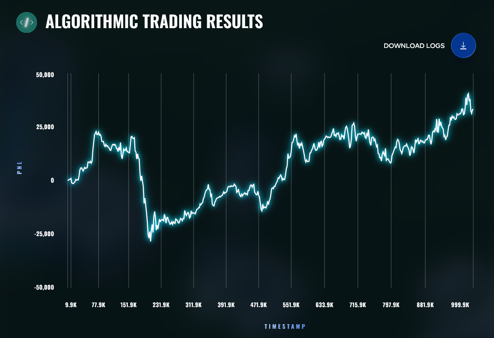

## <a id="manual-challenges"></a>[Manual Challenges](#manual-challenges)


### <a id="manual-round-1"></a>[Round 1: Exchange Auction](#manual-round-1)

Round 1 presented two opening auctions  **Dryland Flax** and **Ember Mushrooms** where we had to submit a single limit order (price, quantity) for each product to maximise profit, knowing that any inventory acquired would be immediately bought back by the Merchant Guild at a fixed price.

The key insight was that profit per unit depended entirely on the spread between the auction clearing price and the guaranteed buyback price, net of any fees. This meant we needed to:

1. **Identify the clearing price**  the price that maximises total traded volume under the auction rules
2. **Bid aggressively enough** to ensure execution, without pushing the clearing price above the buyback price
3. **Size our order** to absorb as much profitable volume as possible, accounting for our last-in-line priority at any price level we joined

We built a simulator (`mannual.ipynb`) to sweep candidate clearing prices across the full order book for both products, computing executed volume and our resulting PnL at each level.

**Dryland Flax**: Bid 9999 units @31, clearing price @29, buyback @30, no fees:

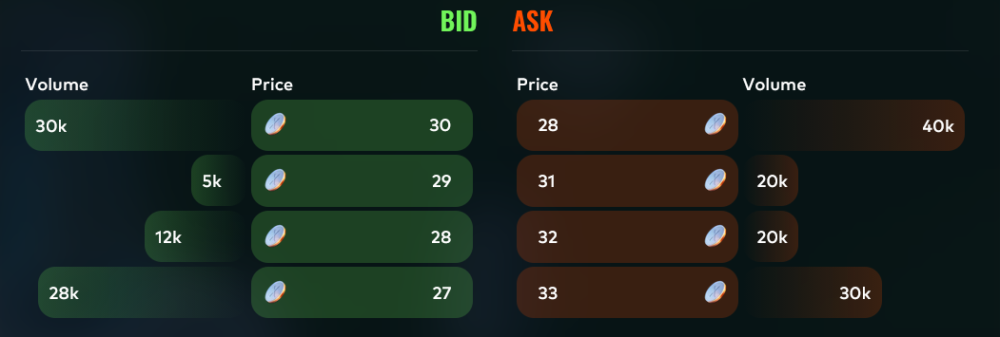

**Ember Mushrooms**: Bid 19999 units @18, clearing price @16, buyback @20, fee of 0.10/unit:

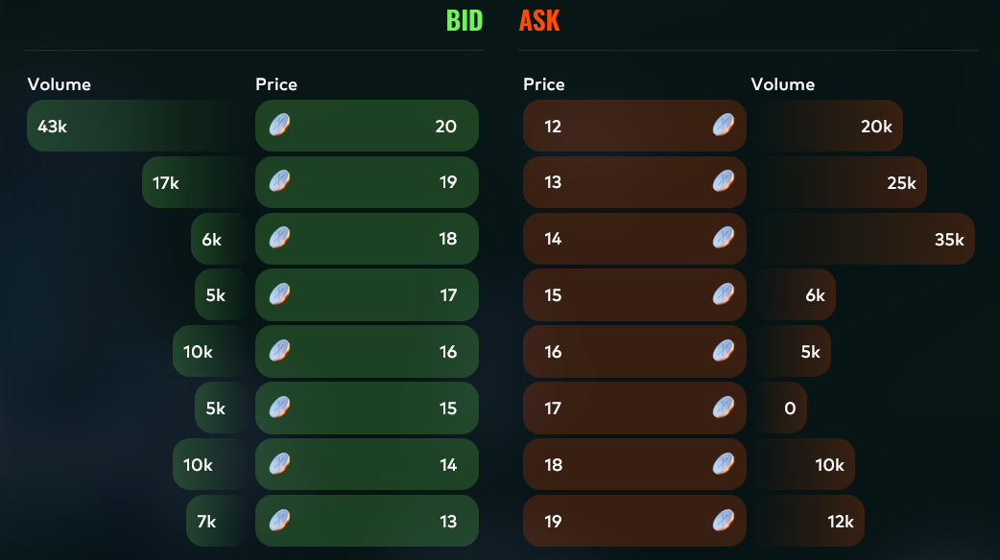


This analysis yielded the **optimal manual submission**, securing **1st place in the manual rankings** for this round.

Manual results:

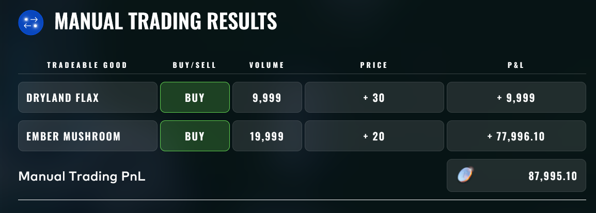

### <a id="manual-round-2"></a>[Round 2: Capital Allocation](#manual-round-2)

In Round 2, we were given a capital allocation challenge where we had to distribute a budget of 50,000 XIRECs across three interdependent pillars **Research**, **Scale**, and **Speed** to maximise a nonlinear PnL function:

```math
\text{PnL} = \text{Research}(x_r) \times \text{Scale}(x_s) \times \text{Speed}(x_{sp}) - \text{Budget\_Used}
```

```math
\begin{aligned}
\text{Research}(x_r) &= 200{,}000 \cdot \frac{\ln(1 + x_r)}{\ln(101)} \\
\text{Scale}(x_s) &= \frac{7}{100} \cdot x_s \\
\text{Speed}(x_{sp}) &= 0.9 - 0.8 \cdot \frac{\text{Rank}(x_{sp}) - 1}{R_{\text{max}} - 1}
\end{aligned}
```

The core difficulty was that each pillar followed a different return structure: Research scaled logarithmically, Scale linearly, and Speed was rank-determined relative to all competing teams, making it the most uncertain and strategically sensitive variable.

Our approach was to tackle the problem in two stages. We first focused on **Speed**, since its multiplier depended entirely on the behaviour of other teams rather than a fixed formula. We analysed the rank-based scoring mechanism and reasoned about likely competitor distributions to arrive at a Speed allocation we were confident would secure a strong relative rank. With that anchor fixed, we then ran a **numerical optimisation** (via `optimizer.html` and `manual.ipynb`) over the remaining budget to find the Research/Scale split that maximised the product of the two analytically-defined pillars given the leftover capital.

We invested the full budget, landing on a final allocation of **34% Speed, 50% Scale, and 16% Research**, a distribution that prioritised broad market deployment and competitive rank while accepting a modest edge, reflecting the classic market-maker trade-off between reach, speed, and depth of insight.

Manual results:

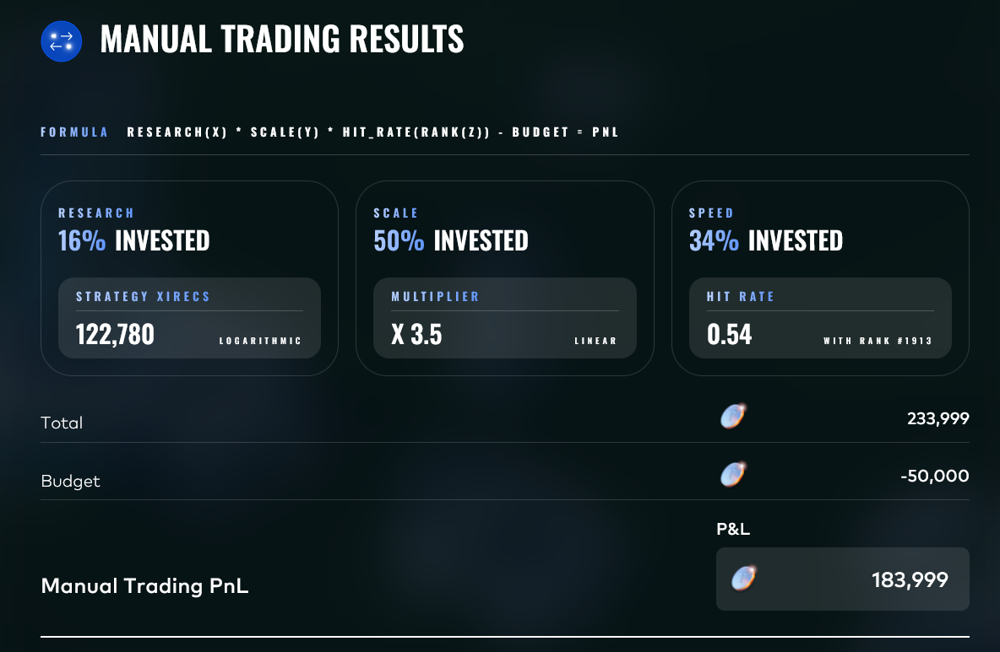

### <a id="manual-round-3"></a>[Round 3: Invest & Expand](#manual-round-3)

Round 3 required submitting two bids against counterparties with uniformly distributed reserve prices between 670 and 920 (in increments of 5), with any acquired inventory sellable the next day at the fair price of 920.

The profit per unit on any trade was simply `920 − bid`, so the lower we bid, the higher the margin, but the fewer counterparties we would trade with. The real strategic tension lived in the **second bid**, which introduced a rank-based penalty: if our second bid fell below the mean second bid of all players, our PnL on those trades was penalised by a steep cubic factor, making an aggressive-but-below-average second bid potentially worse than not trading at all.

The penalization factor was defined as follows:

```math
\left(\frac{920 - \text{avg\_b2}}{920 - b2}\right)^3
```

**A note on bid precision:** since all reserve prices are multiples of 5, any bid ending in 1 or 6 is functionally equivalent to the nearest lower multiple of 5, a counterparty with reserve price 795 accepts a bid of 796, same as a bid of 799. We therefore deliberately chose values ending in **6** (e.g. 796, 906) to sit just above a clean multiple of 5, capturing every counterparty at that threshold without leaving margin on the table.

**First bid 796:** This was intentionally conservative, targeting only counterparties with reserve prices at or below 795 (roughly the lower 26% of the distribution). The margin per unit was a comfortable 124. We were not trying to maximise volume here. The first bid carries no competitive penalty, so we prioritised a reliable, high-margin trade over breadth.

**Second bid 906:** This is where the design of the challenge demanded the most careful reasoning. The cubic penalty for finishing below the mean second bid is severe enough that a slightly-below-average bid can actively destroy value. Our thinking was: if most teams reasoned similarly and clustered their second bids in the 880–910 range out of caution, submitting 906 would likely land at or above the mean, avoiding the penalty entirely while still capturing a thin but positive margin of 14/unit across a large share of the distribution. We accepted that this might be overly conservative, a team willing to bid 850 and trust the field would gain significantly more margin, but the asymmetric downside of the penalty made us reluctant to anchor below what we estimated the crowd would do.

In hindsight, our allocation was **risk-averse by design**: we prioritised penalty avoidance and margin certainty over volume maximisation, reflecting our belief that in a competitive setting with an opaque penalty structure, staying above the crowd's average was worth more than chasing extra units at lower prices.

Manual results:

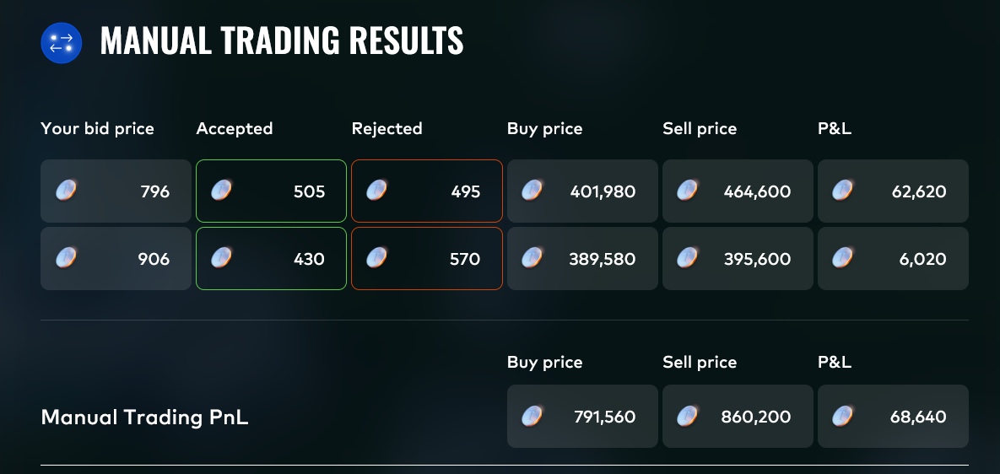

### <a id="manual-round-4"></a>[Round 4: Exotic Derivatives](#manual-round-4)

Round 4 introduced a rich derivatives universe written on `AETHER_CRYSTAL` vanilla calls and puts at 2 and 3 week expiries, alongside three exotic structures (a Chooser, a Binary Put, and a Knock-Out Put) with the objective of constructing a position that maximised expected PnL across 100 simulations of the underlying, held to expiry.

The most immediate signal was the underlying's annualised volatility of **251%**, an extremely high figure that made any unhedged directional exposure dangerous. A naked long or short in the underlying, or an unbalanced options book, could easily see simulated paths swing wildly enough to overwhelm any edge extracted from mispricing. Our primary concern was therefore not just finding positive expected value, but ensuring that delta exposure, our first-order sensitivity to the underlying's moves, was kept tightly controlled.

**Modelling the exotics:** We built a dedicated simulation framework in `manual.ipynb`, implementing Python classes for each product with their precise payoff logic. This was essential for the path-dependent products in particular:
- The **Knock-Out Put** required tracking whether the barrier was breached at any discrete step before expiry
- The **Chooser Option** required simulating the underlying at the 2-week mark to determine which flavour (call or put) the holder would rationally select, then continuing to expiry
- The **Binary Put** had a simple terminal payoff but its delta profile is highly nonlinear near the strike, requiring careful treatment

**Portfolio construction as an integer program:** We formulated the position-sizing problem as an **integer program**: maximise total expected PnL across simulations subject to the constraint that the net portfolio delta remained within a tight neutrality tolerance. Integer constraints were necessary because contract quantities had to be whole numbers bounded by the displayed volume limits. This allowed us to search over the full feasible combination space while respecting both the delta-hedge requirement and the position size caps.

Manual results:

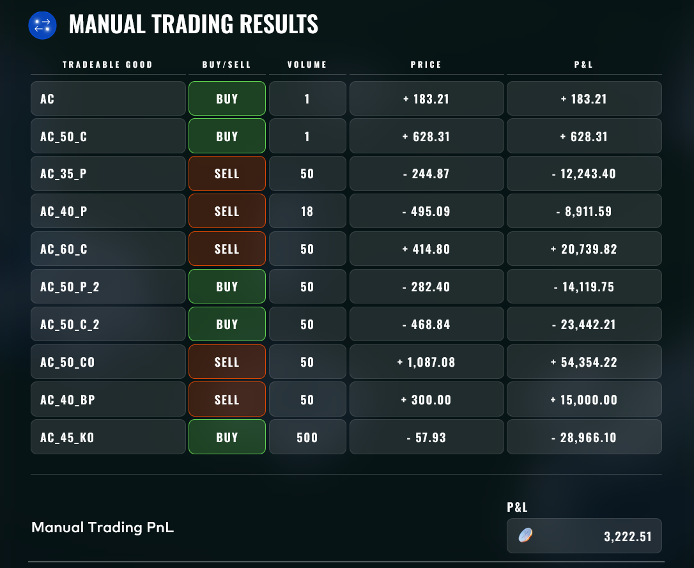

Distribution by Derivative:

<table>
  <tr>
    <td>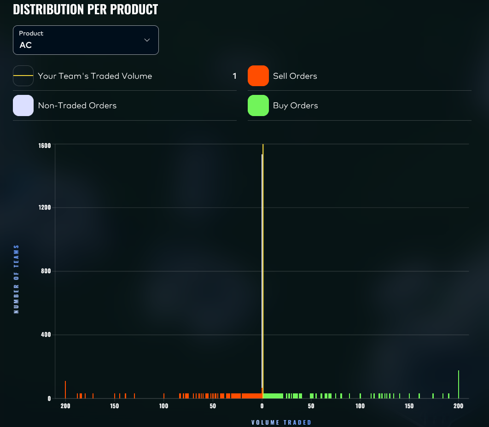<br>AC</td>
    <td>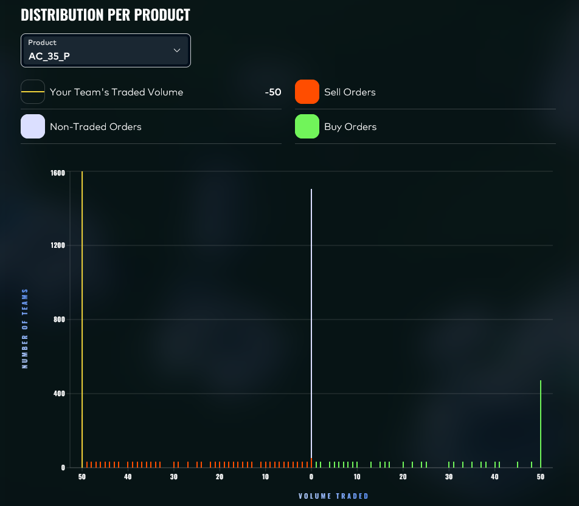<br>AC 35P</td>
    <td>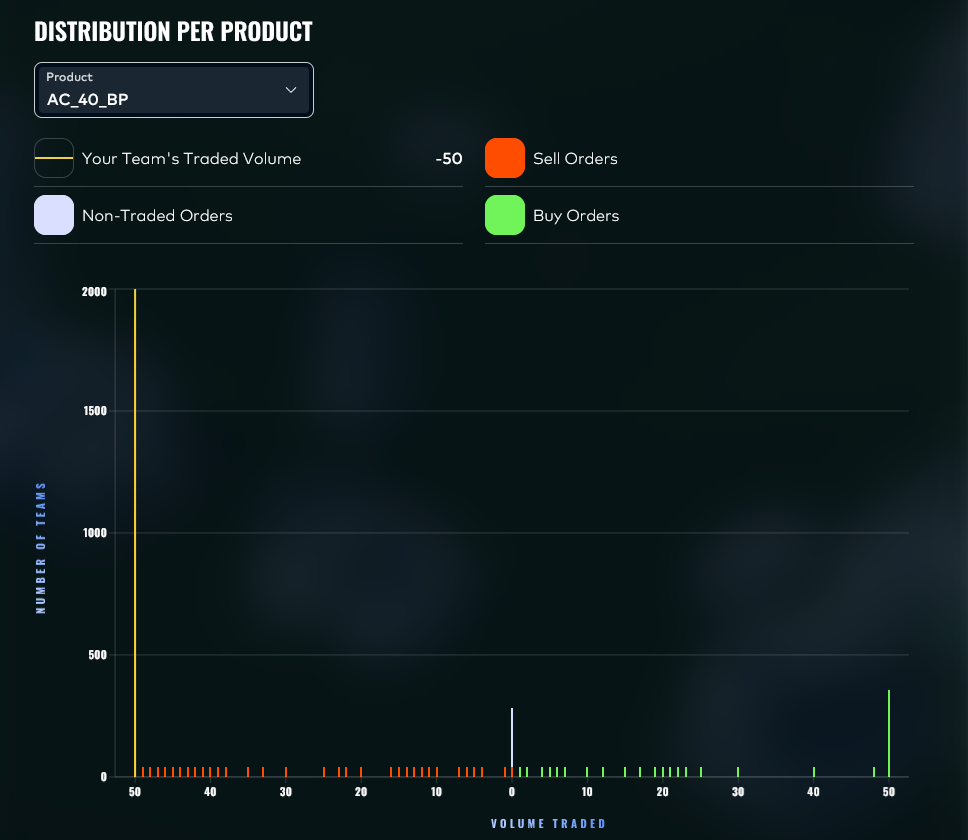<br>AC 40BP</td>
  </tr>
  <tr>
    <td>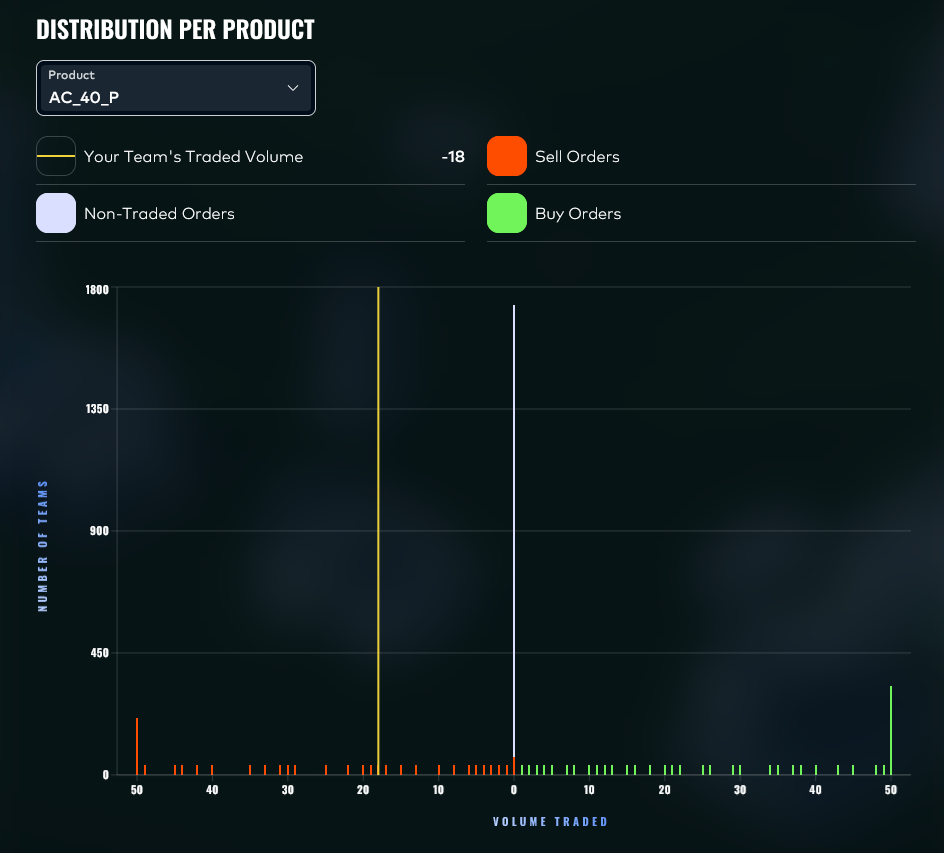<br>AC 40P</td>
    <td>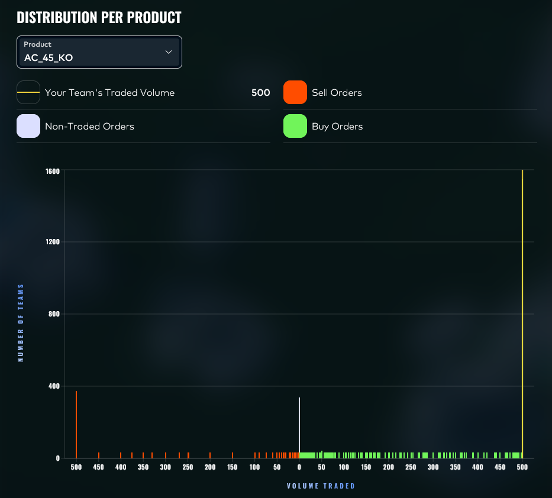<br>AC 45KO</td>
    <td><br>AC 45P</td>
  </tr>
  <tr>
    <td>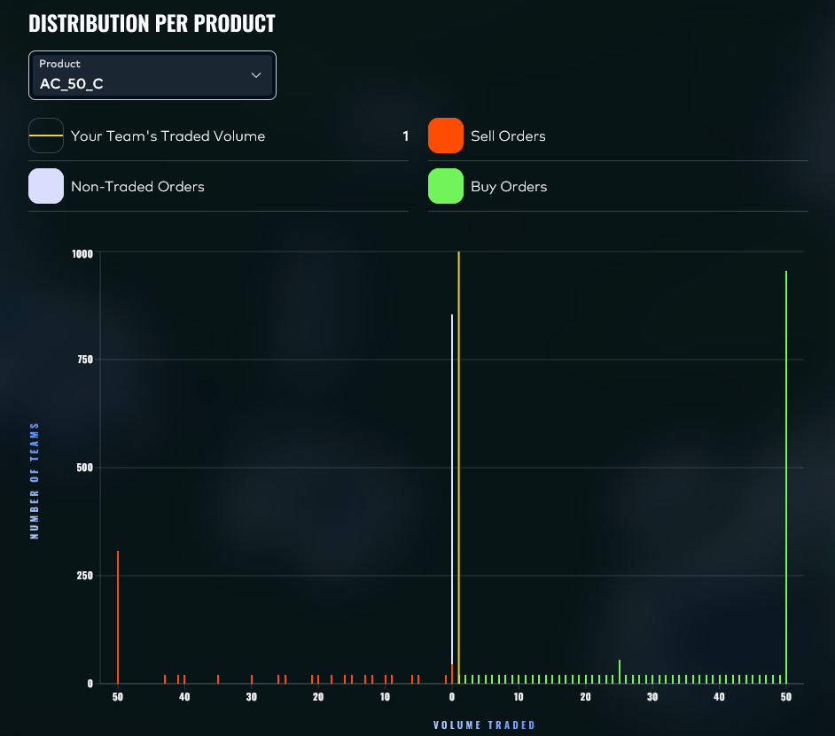<br>AC 50C</td>
    <td>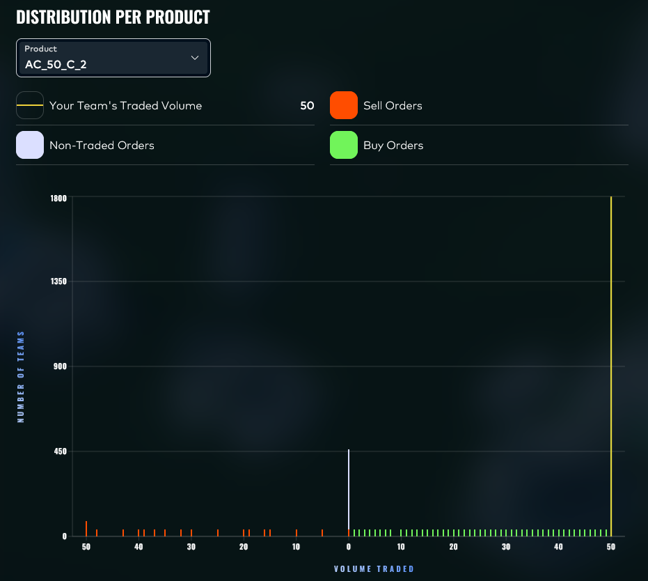<br>AC 50C2</td>
    <td>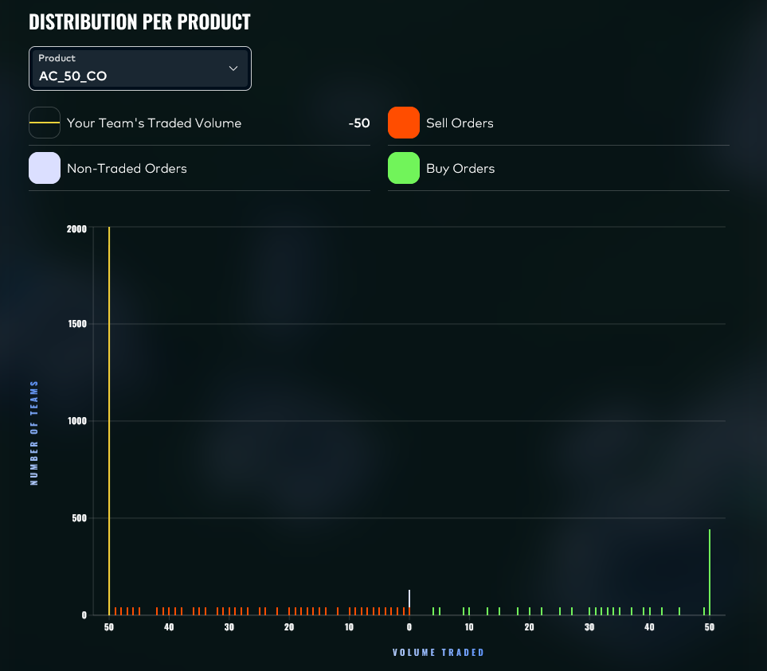<br>AC 50CO</td>
  </tr>
  <tr>
    <td>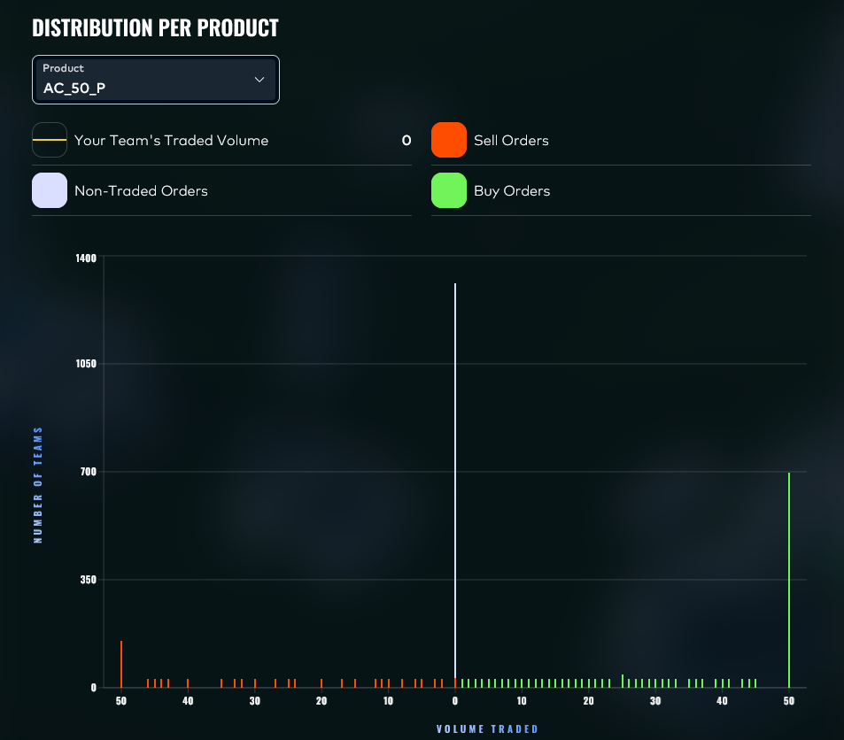<br>AC 50P</td>
    <td>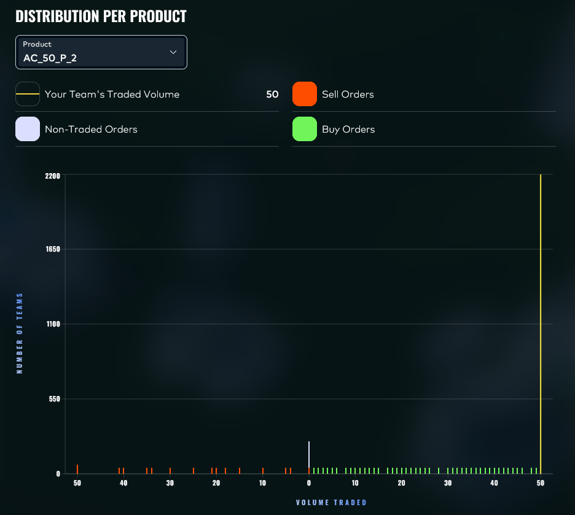<br>AC 50P2</td>
    <td>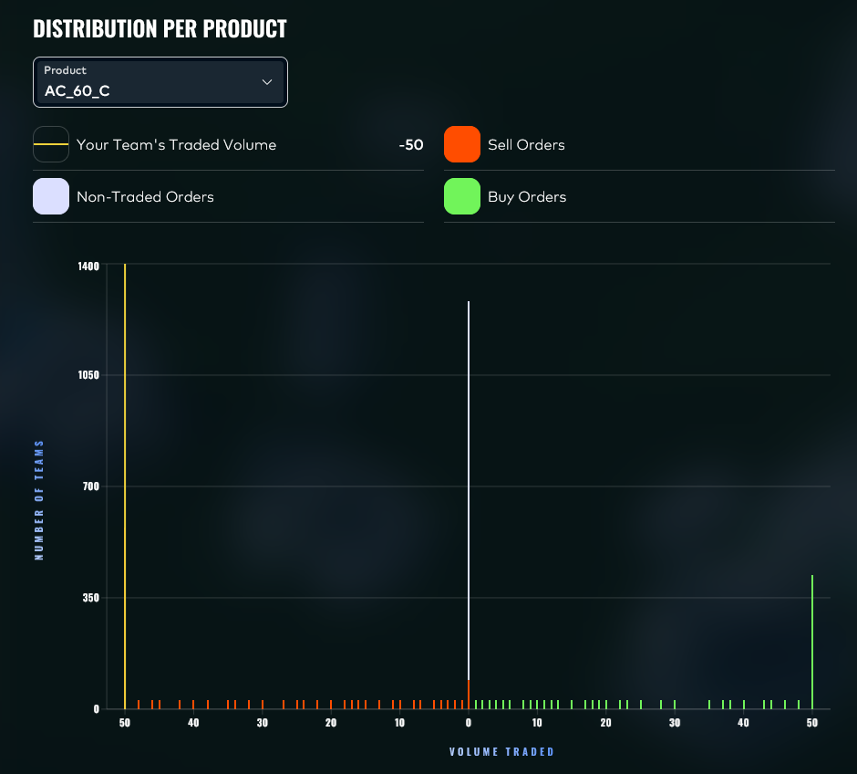<br>AC 60C</td>
  </tr>
</table>

### <a id="manual-round-5"></a>[Round 5: News-Based Trading](#manual-round-5)

Round 5 provided a fictional newspaper: **Ashflow Alpha** and required us to construct a one-day portfolio based on qualitative news interpretation, with a quadratic fee structure that penalised heavy concentration in any single instrument.

Our approach was to read each article and classify the signal as bullish, bearish, or ambiguous, then size positions proportionally to our conviction while keeping an eye on the fee drag that would erode returns on large allocations.

---

**Position-by-position rationale:**

**Magma Ink, BUY 35%:** The largest allocation, driven by the front-page story about the merger between Stip Stationery Enterprises and Splatter Inc. and the launch of the limited-edition Lava Fountain Pen. The crowd queuing for six hours and the "hot drop" framing read as a strong demand signal for Magma Ink as the ink supplier. In hindsight, this was our most costly mistake: the news was likely **already priced in** given how widely the event had been promoted beforehand, and the 35% allocation triggered a fee of 122,500; making the position nearly impossible to profit from even with a positive underlying return. We over-weighted a sentiment story that the market had already absorbed.

**Thermalite Core, BUY 19%:** The quarterly forecast report showed projected active users nearly doubling next quarter (1.42M to 3.09M) with significantly extended daily usage times, a strong forward-looking demand signal. The position returned modestly (+6,004), likely because the optimistic forecast was partially anticipated by the market already.

**Lava Cake, SELL 14%:** Health authorities confirming traces of actual lava in Lava Cakes, an immediate sales halt, civil lawsuits, and vendors returning stock all pointed clearly to a sharp negative move. This was our strongest and cleanest signal, unambiguously bad news with direct commercial impact and it paid off as our most profitable trade (+69,095).

**Pyroflex Cells, SELL 10%:** The abrupt end to the Pyroflex Cell Tax Cut, effectively doubling the levy overnight, was a clear demand headwind. Higher consumer prices would suppress upgrade cycles and slow new purchases. We shorted this and captured a positive return (+9,534), though in hindsight we could have sized this more aggressively given the clarity of the signal.

**Sulfur Reactor, BUY 7%:** Index inclusion is a textbook mechanical buy signal, funds tracking Elemental Index 118 would be forced to purchase Sulfur Reactor upon rebalance. We sized this conservatively given the uncertainty around timing, and it returned a small positive (+7,297).

**Volcanic Incense, BUY 5%:** This was a misjudgement. Whiff Nostralico openly calling his followers to buy Volcanic Incense reads more as a manipulation red flag than a genuine fundamental signal, the buying was concentrated in narrow windows around his appearances, a classic pump pattern. We should have either shorted this or avoided it entirely. Instead we went long and lost (-9,786).

**Scoria Paste, BUY 3%:** Lava D. Ray's call to stockpile Scoria Paste was a weak, influencer-driven signal from a self-proclaimed "market medium" with no credible fundamental backing. We sized it minimally out of caution, and the near-zero result (-500) confirmed there was little real signal here.

**Obsidian Cutlery, no position:** The manufacturing halt story was genuinely negative, but the signal was muddied, the contamination was self-inflicted and the company declined to comment, making the magnitude of impact hard to gauge. We opted out, which in hindsight may have been a missed short opportunity.

---

**What went wrong:**

The overall loss of -32,909 was driven almost entirely by the **Magma Ink** position. The core error was conflating *exciting news* with *new information*, the Lava Fountain Pen launch had been widely promoted beforehand, meaning the demand enthusiasm for Magma Ink was already reflected in prices by the time we traded. Combined with the quadratic fee structure, a 35% allocation to a story that was largely priced in was very costly. A more disciplined approach would have capped single-position sizes to control fee drag, reserved the largest allocations for the clearest and most *unexpected* signals (Lava Cake and Pyroflex Cells), and treated heavily promoted consumer events with more scepticism.

Manual results:

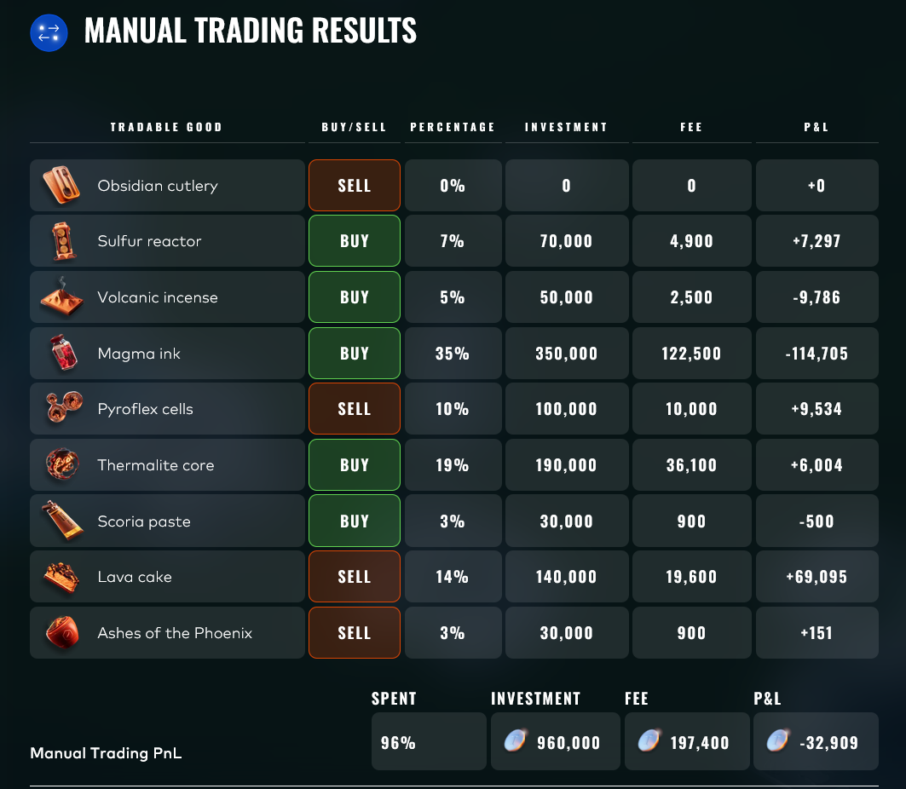

## <a id="reproducibility"></a>[Reproducibility](#reproducibility)

We used **uv** to manage Python and all dependencies.
 
---
 
### 1. Install uv
 
**Windows**: open PowerShell and run:
 
```powershell
powershell -ExecutionPolicy ByPass -c "irm https://astral.sh/uv/install.ps1 | iex"
```
 
**macOS**: open Terminal and run:
 
```bash
curl -LsSf https://astral.sh/uv/install.sh | sh
```
 
Close and reopen your terminal after it finishes. Verify it worked:
 
```bash
uv --version
```
 
You should see something like `uv 0.x.x`. If the command isn't found, restart your terminal and rerun it.
 
---
 
### 2. Clone the repo
 
```bash
git clone https://github.com/marcobattiston21/imc-prosperity-4.git
cd imc-prosperity-4
```
 
---
 
### 3. Create the environment and install dependencies
 
Because we already have a `pyproject.toml` and `uv.lock`, this is a single command. uv will automatically download the right Python version and install every dependency at the exact pinned versions:
 
```bash
uv sync
```
 
That's it. uv creates a `.venv` folder in the project root. You don't need to activate it for most things (uv handles it transparently), but if you need to activate it manually:
 
**Windows:**
```powershell
.venv\Scripts\activate
```
 
**macOS:**
```bash
source .venv/bin/activate
```
 